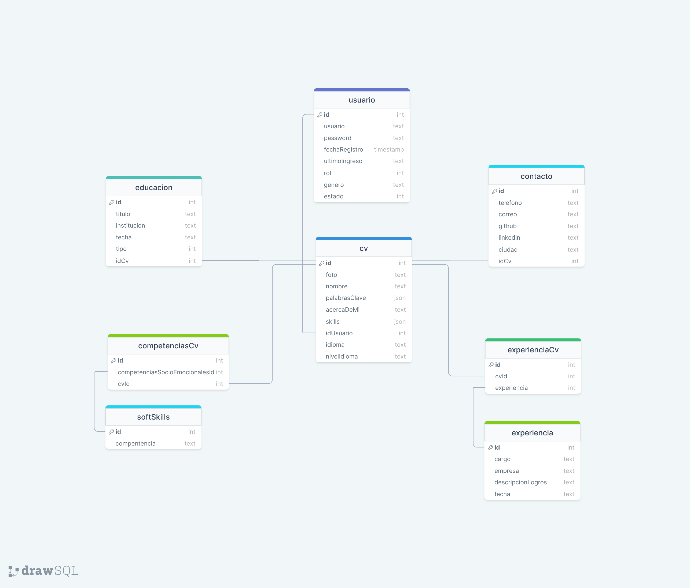
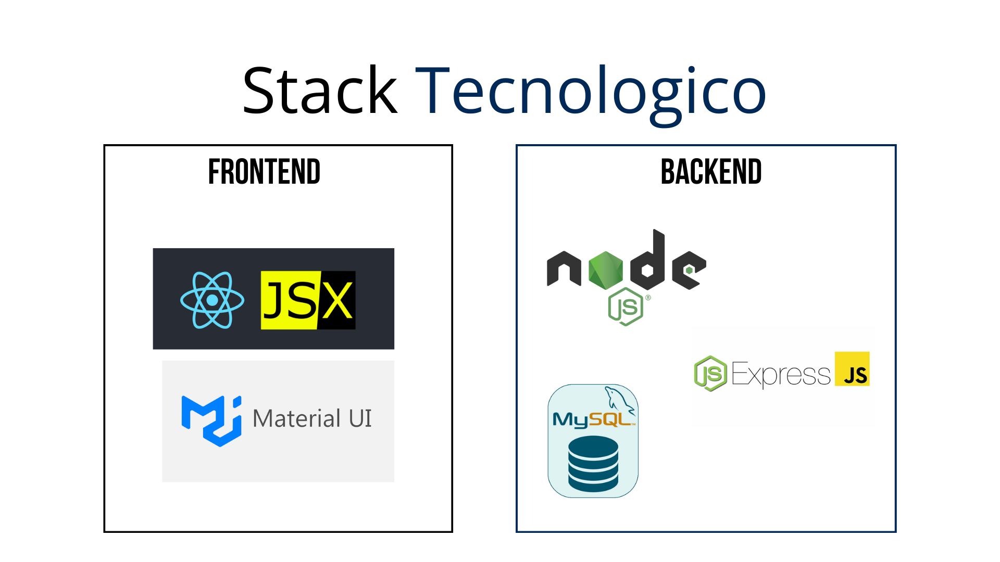

# SideProject



## Stack Tecnologico 



### Requerimientos funcionales

1. La aplicacion debe contar con dos roles Administrativo - Camper

Rol Administrativo
1. Permitir crear nuevos usuarios.
2. Permitir o denegear el acceso a la plataforma a usuarios que se registren por si mismos.
3. Listar usuarios con sus cv cargadas en el sistema.
4. Permitir editar la informacion de un cv de un camper
5. Permitir si la cv de un camper se puede ver o no en la plataforma.
6. Gestionar permiso a un camper para que pueda editar o no la plataforma.

Rol Camper
1. Registrarse en la plataforma.
2. Cargar informacion requerida para poder tener un cv visto 


EndPoints 
CRUD - CV
CRUD - USUARIO
CRUD - EDUCACION
CRUD - SOFTSKILLS
CRUD - EXPERIENCIA 

Tabla Cv - (Get)   
    nombre  
    foto
    palabrasClave
    idioma
    nivel

## ENDPOINTS

se debe tener en cuenta que los endpoints que tiene permiso **Global** se pueden utilizar sin necesidad de realizar un login, loas otros endpoinst solo son permitidos por usuarios logeados dependiendo del rol (**Admin o Camper**).

### Login

- Hacer Login

  **ALL** `http://<host>:<port>/login`

  **Ejemplo datos de entrada**:

  ```json
  {
    "usuario": "usuario",
    "password": "password"
  }
  ```

  usuario admin:

  ```json
  {
    "usuario": "villafrades",
    "password": 123
  }
  ```

### usuario

- obtener todos lo usuarios [Global]

  **GET** `http://<host>:<port>/usuario`

  

- Obtener un usuario especifico [Global]

  **GET** `http://<host>:<port>/usuario?id=<'id'>`

  

- obtener usuarios dependiendo el estado [Admin]

  **GET** `http://<host>:<port>/usuario/estado/<'estado'>`

  

- Obtener la cantidad de usuarios dependiendo el estado

  **GET** `http://<host>:<port>/usuario/cant?estado=<'estado'>`

  

- Agregar un nuevo usuario [Admin, Camper]

  **POST** `http://<host>:<port>/usuario`

  **Ejemplo datos de entrada**

    "usuario":  string,
    "password": [/^(?=.*[a-z])(?=.*[A-Z])(?=.*\d)(?=.*[@$!%*?&.,])[A-Za-z\d@$!%*?&]+$/]   string,
    "genero": [masculino, femenino, otro] string,
    "telefono":  string,
    "correo": string,
    "ciudad": string

  ```json
  {
    "usuario": "usuario1",
    "password": "password1",
    "genero": "masculino",
    "telefono": "3123456789",
    "correo": "usuario1@example.com",
    "ciudad": "Floridablanca"
  }
  ```

  es importante tener en cuenta que cuando de agrega un usuario nuevo, por defecto se agregan los siguiente campos: 

  ```json
  {
    "rol": "usuario",
    "estado": false,
    "fechaRegistro": "fechaActual"
  }
  
  ```

- Modificar un usuario [Admin, Camper]

  **PUT** `http://<host>:<port>/usuario?id=<'id'>`

  

- Modificar el estado o rol de un usuario [Admin]

  **PUT** `http://<host>:<port>/usuario/estado?id=<'id'>`

  **Ejemplo datos de entrada**

  ```json
  {
    "estado": true,
    "rol": "admin",
  }
  ```

  

- Eliminar un usuario

  **DELETE** `http://<host>:<port>/usuario?id=<'id'>`


### CV

- obtener todos los CV   [Global]

  **GET** `http://<host>:<port>/cv`

  

- Obtener un CV especifico [Global]

  **GET** `http://<host>:<port>/cv?id=<'id'>`


- Obtener el CV de un usuario especifico [Global]

  **GET** `http://<host>:<port>/cv/user?id=<'id'>`

  

- obtener los CV dependiendo el estado [Admin]

  **GET** `http://<host>:<port>/cv/estado/<'estado'>`

  

- Obtener la cantidad de CV dependiendo el estado

  **GET** `http://<host>:<port>/cv/cant?estado=<'estado'>`

  

- Agregar un nuevo CV [Admin, Camper]

  **POST** `http://<host>:<port>/cv`

   "nombre":  string,
    "idEnfoque":  int,
    "acercaDeMi":  string,
    "skills":  array,
    "idioma": string,

     "nivelIdioma":  string,
    "github":  string,
    "linkedin":  string,

  **Ejemplo datos de entrada**

  ```json
  {
  	"nombre": "carlos Villafrades Pinilla",
    	"idEnfoque": 2,
    	"acercaDeMi": "Soy un desarrollador de software con 5 años de experiencia. Estoy interesado en trabajar en proyectos de desarrollo web y móvil.",
    	"skills": [
          "habilidad1",
          "nivel1",
          "habilidad2"
        ],
        "idioma": "ingles",
        "nivelIdioma": "A2",
        "github": "https://github.com/juanperezgarcia",
        "linkedin": "https://linkedin.com/in/juanperezgarcia"
  }
  ```

  por defecto se agrega el estado:false y el accesoEditar:true

  

- Modificar el cv [Admin-Camper]

  **PUT** `http://<host>:<port>/cv?id=<'id'>`

  el  [Admin-Camper] puede modificar cualquier propiedad de la cv, pero el Admin es el unico que puede modificar las propiedades de estado y accesoEditar

  ```json
  {
    "estado": true,
    "accesoEditar": false,
  }
  ```

  

- Eliminar un cv

  **DELETE** `http://<host>:<port>/cv?id=<'id'>`

  

### Educacion 

- obtener toda la Educacion de cada una de las cv   [Global]

  **GET** `http://<host>:<port>/educacion`

  

- Obtener una Educacion especifica [Global]

  **GET** `http://<host>:<port>/educacion?id=<'id'>`

  

- obtener toda la educacion de un CV especifico [Global]

  **GET** `http://<host>:<port>/educacion/cv?id=<'id'>`

  

- Agregar una nueva educacion [Admin, Camper]

  **POST** `http://<host>:<port>/educacion`

   "tipo":  string,
    "fecha":  date,
    "titulo":  string,
    "institucion":  string,

  

  **Ejemplo datos de entrada**

  ```json
  {
      	"tipo": "Bachillerato",
        "fecha": "2023-12-10",
        "titulo": "Diplomado en Diseño Gráfico",
        "institucion": "Instituto Y"
  }
  ```

  si el usuario que va a realizar el post tiene el rol 'usuario' se le agrega por defecto el id de la cv de ese usuario

  si el usuario tiene el rol de 'usuario' solo podra agregar siempre y cuando la cv tenga en true el accesoEditar

  

- Modificar una educacion [Admin-Camper]

  **PUT** `http://<host>:<port>/educacion?id=<'id'>`

  si el usuario tiene el rol de 'usuario' solo podra modificar siempre y cuando la cv tenga en true el accesoEditar

  

- Eliminar un educacion 

  **DELETE** `http://<host>:<port>/educacion?id=<'id'>`

  si el usuario tiene el rol de 'usuario' solo podra eliminar siempre y cuando la cv tenga en true el accesoEditar

  

### Experiencia

- obtener toda la Experiencia de cada una de las cv   [Global]

  **GET** `http://<host>:<port>/experiencia`

  

- Obtener una Experiencia especifica [Global]

  **GET** `http://<host>:<port>/experiencia?id=<'id'>`

  

- obtener toda la Experiencia de un CV especifico [Global]

  **GET** `http://<host>:<port>/experiencia/cv?id=<'id'>`

  

- Agregar una nueva Experiencia [Admin, Camper]

  **POST** `http://<host>:<port>/experiencia`

   "cargo":  string,
    "fecha":  date,
    "empresa":  string,
    "descripcionLogros":  string,

  

  **Ejemplo datos de entrada**

  ```json
  {
      	"cargo": "Desarrollador backend",
            "fecha": "2023-01-01",
            "empresa": "Empresa X",
            "descripcionLogros": "Desarrollé la página web de la empresa, utilizando HTML, CSS 			y JavaScript."
  }
  ```

  si el usuario que va a realizar el post tiene el rol 'usuario' se le agrega por defecto el id de la cv de ese usuario

  si el usuario tiene el rol de 'usuario' solo podra agregar un experiencia siempre y cuando la cv tenga en true el accesoEditar

  

- Modificar una experiencia [Admin-Camper]

  **PUT** `http://<host>:<port>/experiencia?id=<'id'>`

  si el usuario tiene el rol de 'usuario' solo podra modificar siempre y cuando la cv tenga en true el accesoEditar

  

- Eliminar una experiencia

  **DELETE** `http://<host>:<port>/experiencia?id=<'id'>`

  si el usuario tiene el rol de 'usuario' solo podra eliminar siempre y cuando la cv tenga en true el accesoEditar


### softSkills

- obtener toda las softSkills de cada una de las cv   [Global]

  **GET** `http://<host>:<port>/skills`

  

- Obtener una softSkills especifica [Global]

  **GET** `http://<host>:<port>/skills?id=<'id'>`

  

- obtener toda las softSkills de un CV especifico [Global]

  **GET** `http://<host>:<port>/skills/cv?id=<'id'>`

  

- Agregar una nueva softSkills  [Admin, Camper]

  **POST** `http://<host>:<port>/skills`

   "compentencia":  string,

  

  **Ejemplo datos de entrada**

  ```json
  {
      	"compentencia":"orientacion al logro"
  }
  ```

  si el usuario que va a realizar el post tiene el rol 'usuario' se le agrega por defecto el id de la cv de ese usuario

  si el usuario tiene el rol de 'usuario' solo podra agregar una softSkill siempre y cuando la cv tenga en true el accesoEditar

  

- Modificar una softSkills   [Admin-Camper]

  **PUT** `http://<host>:<port>/skills?id=<'id'>`

  si el usuario tiene el rol de 'usuario' solo podra modificar siempre y cuando la cv tenga en true el accesoEditar

  

- Eliminar una softSkills  

  **DELETE** `http://<host>:<port>/skills?id=<'id'>`

  si el usuario tiene el rol de 'usuario' solo podra eliminar siempre y cuando la cv tenga en true el accesoEditar

  

### Enfoque

- obtener todos los enfoques  [Global]

  **GET** `http://<host>:<port>/enfoque`

  

- Obtener un Enfoque especifico [Global]

  **GET** `http://<host>:<port>/enfoque?id=<'id'>`

  

- Agregar un nuevo enfoque  [Admin]

  **POST** `http://<host>:<port>/enfoque`

   "nombre":  string

  

  **Ejemplo datos de entrada**

  ```json
  {
      	"nombre": "Desarrollador backend",
  }
  ```

  

- Modificar un enfoque [Admin]

  **PUT** `http://<host>:<port>/enfoque?id=<'id'>`

  

- Eliminar un enfoque [Admin]

  **DELETE** `http://<host>:<port>/enfoque?id=<'id'>`

  

### Contacto

- obtener todos los mensajes de contacto [Admin]

  **GET** `http://<host>:<port>/contacto`

  

- Agregar un nuevo mensaje de contacto [Global]

  **POST** `http://<host>:<port>/contacto`

   "nombre":  string,

   "telefono":  string,

   "empresa":  string,

   "correo":  email,

   "descripcion":  string

  

  **Ejemplo datos de entrada**

  ```json
  {
      "nombre": "carlos villa",
      "telefono": "315642512",
      "empresa": "campuslands",
      "correo":"ejemplo@gmail.com",
      "descripcion": "me interesa campus",
  }
  ```

  

  


