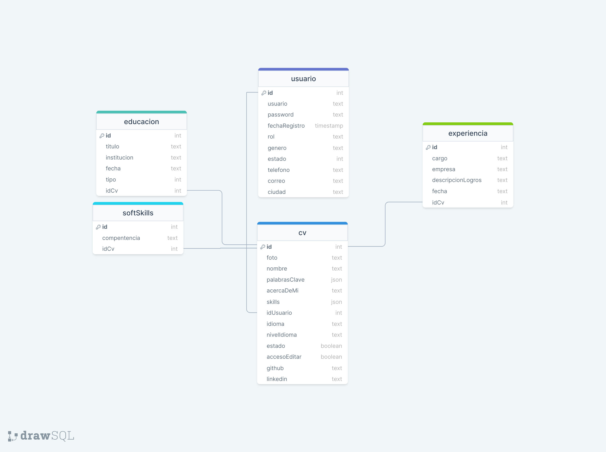

# SideProject

## Stack Tecnologico 

### Requerimientos funcionales

1. La aplicacion debe contar con dos roles Administrativo - Camper

Rol Administrativo
1. Permitir crear nuevos usuarios.
2. Permitir o denegear el acceso a la plataforma a usuarios que se registren por si mismos.
3. Listar usuarios con sus cv cargadas en el sistema.
4. Permitir editar la informacion de un cv de un camper
5. Permitir si la cv de un camper se puede ver o no en la plataforma.
6. Gestionar permiso a un camper para que pueda editar o no la plataforma.

Rol Camper
1. Registrarse en la plataforma.
2. Cargar informacion requerida para poder tener un cv visto 

EndPoints 
CRUD - CV
CRUD - USUARIO
CRUD - EDUCACION
CRUD - SOFTSKILLS
CRUD - EXPERIENCIA 

Tabla Cv - (Get)   
    nombre  
    foto
    palabrasClave
    idioma
    nivel
